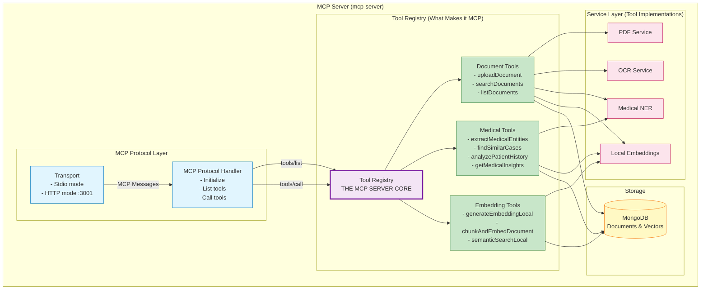

# Medical MCP Server

A comprehensive Model Context Protocol (MCP) server for medical document processing with advanced AI capabilities. This server provides document upload, OCR processing, medical Named Entity Recognition (NER), local embedding generation, and vector-based semantic search for healthcare applications.

## 🏥 Features

- **Document Processing**: Upload and process medical documents (PDF, images) with automatic text extraction
- **Medical NER**: Extract medical entities (medications, conditions, procedures, lab values) from text
- **Local Embeddings**: Generate embeddings using local HuggingFace models for privacy and control
- **Vector Search**: Semantic similarity search across medical documents and patient data
- **OCR Processing**: Extract text from medical images and scanned documents
- **PDF Support**: Process medical PDFs with text extraction and analysis
- **MongoDB Integration**: Store documents, embeddings, and medical entities with optimized indexes
- **Multiple Transport Modes**: HTTP and STDIO transport support
- **Health Monitoring**: Built-in health check endpoints and service monitoring
- **Document Management**: Complete CRUD operations for medical documents

## 📋 Available Tools

### Document Management
- **`uploadDocument`** - Upload and process medical documents with automatic text extraction, NER, and embedding generation
- **`searchDocuments`** - Search documents using vector similarity and text search with hybrid ranking
- **`listDocuments`** - List documents with filtering by patient, document type, or date range

### Medical Analysis
- **`extractMedicalEntities`** - Extract medical entities (medications, conditions, procedures, etc.) from text
- **`findSimilarCases`** - Find similar medical cases based on symptoms, conditions, or medications
- **`analyzePatientHistory`** - Analyze patient medical history with timeline, summary, or trend analysis
- **`getMedicalInsights`** - Get medical insights and recommendations based on query and context

### Embedding & Search
- **`generateEmbeddingLocal`** - Generate embeddings locally using HuggingFace transformers
- **`chunkAndEmbedDocument`** - Split large documents into chunks and generate embeddings for each
- **`semanticSearchLocal`** - Perform semantic search using local embeddings

## 🚀 Quick Start

### Prerequisites

- Node.js 18.0.0 or higher
- TypeScript 5.0.0 or higher
- MongoDB 4.4 or higher
- Python 3.8+ (for local embedding models)
- Tesseract OCR (for image text extraction)

### MERMAID DIAGRAM: -



### Installation

```bash
# Clone the repository
git clone https://github.com/your-username/medical-mcp-server.git
cd medical-mcp-server

# Install dependencies
npm install

# Install Python dependencies for embeddings
pip install torch transformers sentence-transformers

# Install Tesseract OCR
# On Ubuntu/Debian:
sudo apt-get install tesseract-ocr

# On macOS:
brew install tesseract

# On Windows:
# Download from: https://github.com/UB-Mannheim/tesseract/wiki

# Build the project
npm run build
```

### Environment Configuration

Create a `.env` file in the root directory:

```env
# MongoDB Configuration (Required)
MONGODB_CONNECTION_STRING=mongodb://localhost:27017/medical_mcp
MONGODB_DATABASE_NAME=MCP

# Server Configuration
MCP_HTTP_PORT=3001
MCP_HTTP_MODE=true

# OCR Configuration
TESSERACT_PATH=/usr/bin/tesseract
OCR_LANGUAGE=eng

# Embedding Model Configuration
EMBEDDING_MODEL=sentence-transformers/all-MiniLM-L6-v2
EMBEDDING_DEVICE=cpu
EMBEDDING_CACHE_DIR=./models

# Document Storage
DOCUMENT_UPLOAD_PATH=./uploads
MAX_DOCUMENT_SIZE=10485760

# Logging
LOG_LEVEL=info
LOG_FILE=./logs/medical-mcp.log
```

### MongoDB Setup

```bash
# Start MongoDB
mongod --dbpath ./data/db

# Create indexes (run once)
npm run setup-indexes
```

### Running the Server

#### HTTP Mode (Recommended)
```bash
npm run start:http
```

#### STDIO Mode
```bash
npm run start:stdio
```

#### Development Mode
```bash
npm run dev:http
```

## 📊 Health Monitoring

Check server health:
```bash
curl http://localhost:3001/health
```

Response:
```json
{
  "status": "healthy",
  "server": "medical-mcp-server-with-epic",
  "version": "1.0.0",
  "features": [
    "document-processing",
    "medical-ner", 
    "vector-search",
    "epic-fhir"
  ],
  "services": {
    "mongodb": true,
    "localEmbedding": true,
    "ner": true,
    "ocr": true,
    "pdf": true
  },
  "statistics": {
    "documentsCount": 150,
    "embeddingModel": "sentence-transformers/all-MiniLM-L6-v2",
    "uptime": 3600
  },
  "timestamp": "2025-01-23T10:30:00.000Z"
}
```

## 🔧 Tool Usage Examples

### Upload Medical Document
```json
{
  "tool": "uploadDocument",
  "arguments": {
    "title": "Patient Lab Results - John Doe",
    "filePath": "/path/to/lab-results.pdf",
    "metadata": {
      "fileType": "pdf",
      "patientId": "patient-123",
      "documentType": "lab_report",
      "tags": ["blood-work", "lipid-panel"]
    }
  }
}
```

### Search Documents
```json
{
  "tool": "searchDocuments",
  "arguments": {
    "query": "high cholesterol treatment recommendations",
    "limit": 10,
    "searchType": "hybrid",
    "filter": {
      "documentType": "clinical_note",
      "patientId": "patient-123"
    }
  }
}
```

### Extract Medical Entities
```json
{
  "tool": "extractMedicalEntities",
  "arguments": {
    "text": "Patient presents with hypertension and diabetes. Prescribed metformin 500mg twice daily and lisinopril 10mg once daily.",
    "entityTypes": ["MEDICATION", "CONDITION", "DOSAGE"]
  }
}
```

### Find Similar Cases
```json
{
  "tool": "findSimilarCases",
  "arguments": {
    "symptoms": ["chest pain", "shortness of breath"],
    "conditions": ["hypertension"],
    "patientId": "patient-123",
    "limit": 5
  }
}
```

### Generate Local Embedding
```json
{
  "tool": "generateEmbeddingLocal",
  "arguments": {
    "text": "Patient has a history of coronary artery disease and recent myocardial infarction",
    "metadata": {
      "patientId": "patient-123",
      "documentType": "clinical_note"
    }
  }
}
```

## 📚 API Reference

### MCP Endpoint
- **URL**: `http://localhost:3001/mcp`
- **Method**: POST
- **Content-Type**: application/json
- **Format**: JSON-RPC 2.0

### Health Check
- **URL**: `http://localhost:3001/health`
- **Method**: GET

## 🛠 Development

### Scripts

```bash
# Build TypeScript
npm run build

# Start in HTTP mode
npm run start:http

# Start in STDIO mode
npm run start:stdio

# Development with hot reload
npm run dev:http

# Clean build artifacts
npm run clean

# Setup MongoDB indexes
npm run setup-indexes

# Run tests
npm test

# Lint code
npm run lint
```

### Project Structure

```
medical-mcp-server/
├── src/
│   ├── server.ts              # Main server implementation
│   ├── db/
│   │   ├── mongodb-client.ts  # MongoDB connection and operations
│   │   └── setup-vector-indexes.ts # Database index setup
│   ├── services/
│   │   ├── local-embedding-service.ts # HuggingFace embedding service
│   │   ├── medical-ner-service.ts     # Medical NER processing
│   │   ├── ocr-service.ts            # OCR text extraction
│   │   └── pdf-service.ts            # PDF processing
│   └── tools/
│       ├── document-tools.ts         # Document management tools
│       ├── medical-tools.ts          # Medical analysis tools
│       └── local-embedding-tools.ts  # Embedding and search tools
├── dist/                      # Compiled JavaScript
├── uploads/                   # Document upload directory
├── models/                    # Local AI model cache
├── logs/                      # Server logs
├── package.json
├── tsconfig.json
└── .env                       # Environment configuration
```

## 🤖 AI Models & Services

### Local Embedding Models
- **Default**: `sentence-transformers/all-MiniLM-L6-v2`
- **Medical Specialized**: `clinical-ai/ClinicalBERT`
- **Large Model**: `sentence-transformers/all-mpnet-base-v2`

### Medical NER Models
- **BioBERT**: For biomedical text processing
- **ClinicalBERT**: Specialized for clinical notes
- **SciSpaCy**: Medical entity recognition

### OCR Engine
- **Tesseract**: Multi-language OCR support
- **Medical Enhancements**: Prescription, lab report, clinical note optimizations

## 🔍 Troubleshooting

### Common Issues

1. **MongoDB Connection Failures**
   - Verify MongoDB is running and accessible
   - Check connection string format
   - Ensure database permissions

2. **OCR Processing Errors**
   - Install Tesseract OCR engine
   - Verify TESSERACT_PATH environment variable
   - Check image file formats (PNG, JPG, PDF supported)

3. **Embedding Model Issues**
   - Ensure sufficient disk space for model downloads
   - Check Python dependencies (torch, transformers)
   - Verify internet connection for initial model download

4. **Memory Issues**
   - Adjust embedding batch size for large documents
   - Consider using smaller embedding models
   - Monitor MongoDB memory usage

5. **Document Upload Failures**
   - Check file size limits (default 10MB)
   - Verify upload directory permissions
   - Ensure supported file formats

### Debugging

Enable detailed logging:
```bash
# Set log level to debug
export LOG_LEVEL=debug
npm run dev:http
```

Check MongoDB indexes:
```bash
# Connect to MongoDB and list indexes
mongo medical_mcp
db.documents.getIndexes()
db.embeddings.getIndexes()
```

Monitor embedding service:
```bash
# Check embedding model status
curl http://localhost:3001/health | jq '.services.localEmbedding'
```

## 📄 Package.json

```json
{
  "name": "medical-mcp-server",
  "version": "1.0.0",
  "description": "Medical MCP Server with document processing, NER, and vector search capabilities",
  "type": "module",
  "main": "dist/server.js",
  "bin": {
    "medical-mcp-server": "./dist/server.js"
  },
  "scripts": {
    "build": "tsc",
    "start": "node dist/server.js",
    "start:http": "MCP_HTTP_MODE=true node dist/server.js",
    "start:stdio": "node dist/server.js",
    "dev": "tsc --watch & nodemon dist/server.js",
    "dev:http": "MCP_HTTP_MODE=true tsc --watch & nodemon dist/server.js",
    "clean": "rm -rf dist",
    "setup-indexes": "node dist/db/setup-vector-indexes.js",
    "test": "jest",
    "lint": "eslint src/**/*.ts",
    "lint:fix": "eslint src/**/*.ts --fix"
  },
  "keywords": [
    "medical",
    "healthcare",
    "mcp",
    "ner",
    "ocr",
    "embeddings",
    "vector-search",
    "document-processing",
    "mongodb",
    "huggingface"
  ],
  "author": "Your Name",
  "license": "MIT",
  "dependencies": {
    "@modelcontextprotocol/sdk": "^0.5.0",
    "cors": "^2.8.5",
    "dotenv": "^17.2.0",
    "express": "^4.18.2",
    "mongodb": "^6.3.0",
    "multer": "^1.4.5",
    "pdf-parse": "^1.1.1",
    "tesseract.js": "^5.0.0",
    "uuid": "^9.0.1"
  },
  "devDependencies": {
    "@types/cors": "^2.8.13",
    "@types/express": "^4.17.17",
    "@types/multer": "^1.4.11",
    "@types/node": "^20.0.0",
    "@types/uuid": "^9.0.8",
    "eslint": "^8.57.0",
    "@typescript-eslint/eslint-plugin": "^7.0.0",
    "@typescript-eslint/parser": "^7.0.0",
    "jest": "^29.7.0",
    "@types/jest": "^29.5.0",
    "nodemon": "^3.0.0",
    "typescript": "^5.0.0"
  },
  "engines": {
    "node": ">=18.0.0"
  },
  "repository": {
    "type": "git",
    "url": "https://github.com/your-username/medical-mcp-server.git"
  },
  "bugs": {
    "url": "https://github.com/your-username/medical-mcp-server/issues"
  },
  "homepage": "https://github.com/your-username/medical-mcp-server#readme"
}
```

## 🐳 Docker Support

### Dockerfile
```dockerfile
FROM node:18-alpine

# Install system dependencies
RUN apk add --no-cache \
    tesseract-ocr \
    tesseract-ocr-data-eng \
    python3 \
    py3-pip \
    build-base

# Install Python dependencies
RUN pip3 install torch transformers sentence-transformers

WORKDIR /app

# Copy package files
COPY package*.json ./
RUN npm ci --only=production

# Copy source code
COPY dist/ ./dist/
COPY uploads/ ./uploads/
COPY models/ ./models/

EXPOSE 3001

CMD ["npm", "start"]
```

### Docker Compose
```yaml
version: '3.8'

services:
  medical-mcp-server:
    build: .
    ports:
      - "3001:3001"
    environment:
      - MONGODB_CONNECTION_STRING=mongodb://mongo:27017/medical_mcp
      - MCP_HTTP_MODE=true
    depends_on:
      - mongo
    volumes:
      - ./uploads:/app/uploads
      - ./models:/app/models

  mongo:
    image: mongo:7
    ports:
      - "27017:27017"
    volumes:
      - mongo-data:/data/db

volumes:
  mongo-data:
```

## 📄 License

MIT License - see [LICENSE](LICENSE) file for details.

## 🤝 Contributing

1. Fork the repository
2. Create a feature branch (`git checkout -b feature/amazing-feature`)
3. Commit your changes (`git commit -m 'Add amazing feature'`)
4. Push to the branch (`git push origin feature/amazing-feature`)
5. Open a Pull Request

## 📞 Support

- **MongoDB Documentation**: [MongoDB Docs](https://docs.mongodb.com/)
- **HuggingFace Transformers**: [Transformers Documentation](https://huggingface.co/docs/transformers)
- **Model Context Protocol**: [MCP Documentation](https://modelcontextprotocol.io/)
- **Issues**: [GitHub Issues](https://github.com/KalyankumarKonduru/medical-mcp-server/issues)


---

**Note**: This server processes medical documents and requires proper security measures for production deployment. Ensure compliance with HIPAA and other healthcare regulations when handling real patient data.
